# Omarchy Phosphor OS Theme

A phosphor-green, CRT-inspired dark theme grounded in Matrix Base16 tones with vivid neon accents and soft terminal-glow contrast.

## Preview


## Install

Use the Omarchy theme installer:

```bash
omarchy-theme-install https://github.com/oldjobobo/omarchy-phosphor-os-theme
```

## What's included

- Hyprland rules and opacity tuning (`hyprland.conf`)
- Hyprlock styling (`hyprlock.conf`)
- Waybar colors (`waybar.css`, `waybar-theme`)
- Terminals: Alacritty (`alacritty.toml`), Kitty (`kitty.conf`), Ghostty (`ghostty.conf`), Warp (`warp.yaml`)
- Shell/tools: Fish colors (`colors.toml`), Walker (`walker.css`)
- Apps/UI: GTK (`gtk.css`), Chromium (`chromium.theme`), Wofi (`wofi.css`)
- System tools: btop (`btop.theme`), mako (`mako.ini`), SwayOSD (`swayosd.css`)
- Extras: Vencord (`vencord.theme.css`), Zed (`aether.zed.json`, `aether.override.css`), Neovim (`neovim.lua`), Icons (`icons.theme`)

## Wallpapers

| | | |
| --- | --- | --- |
| 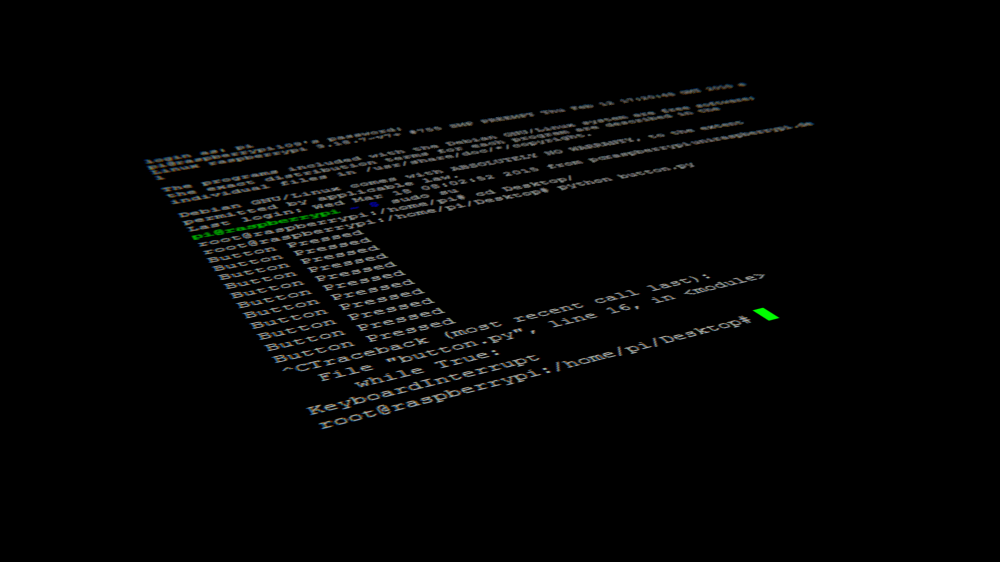 | 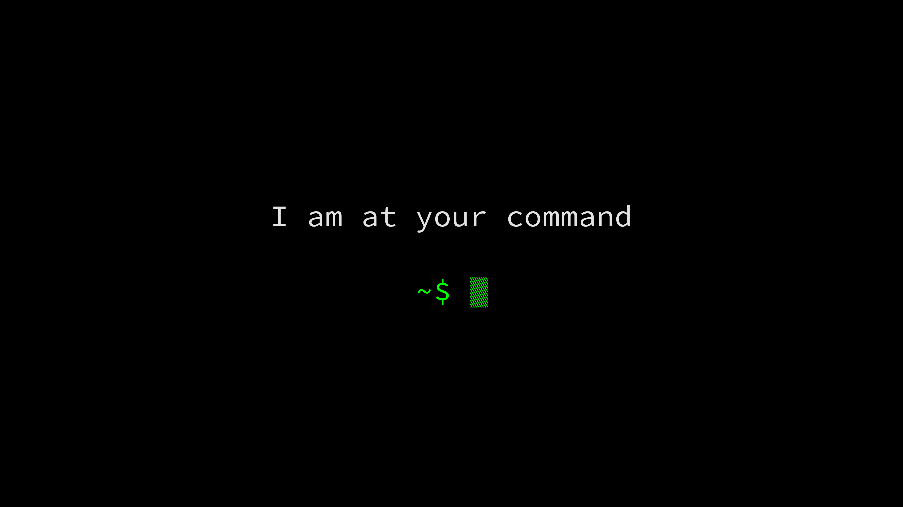 | 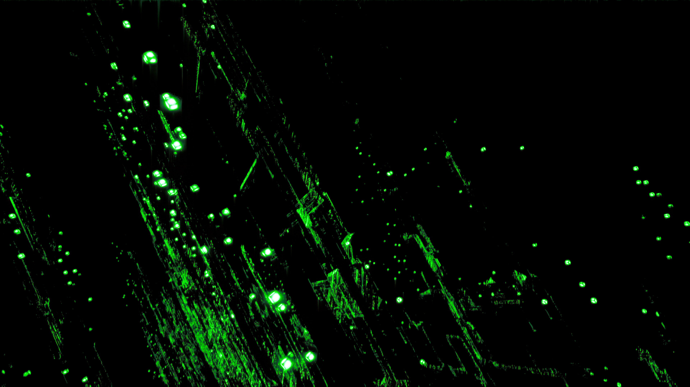 |
|  | 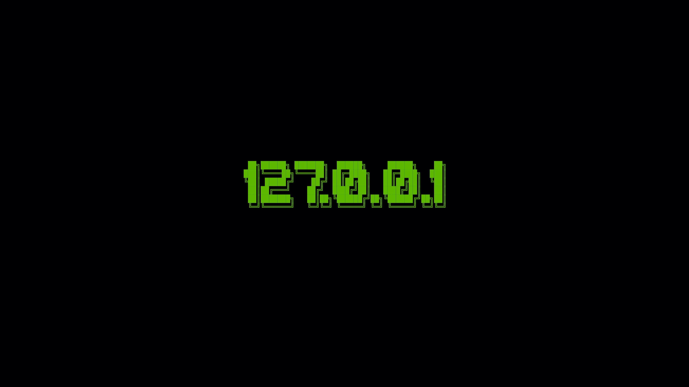 | 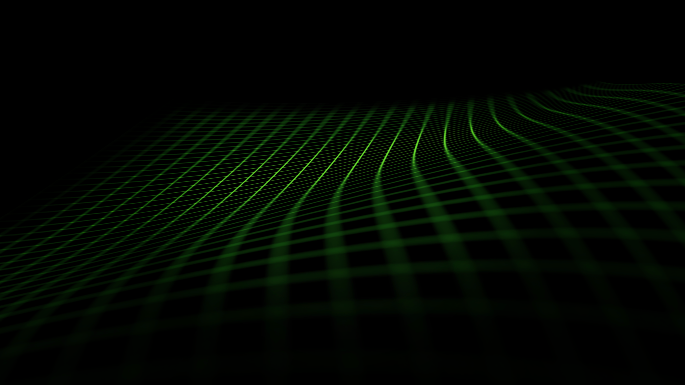 |
| 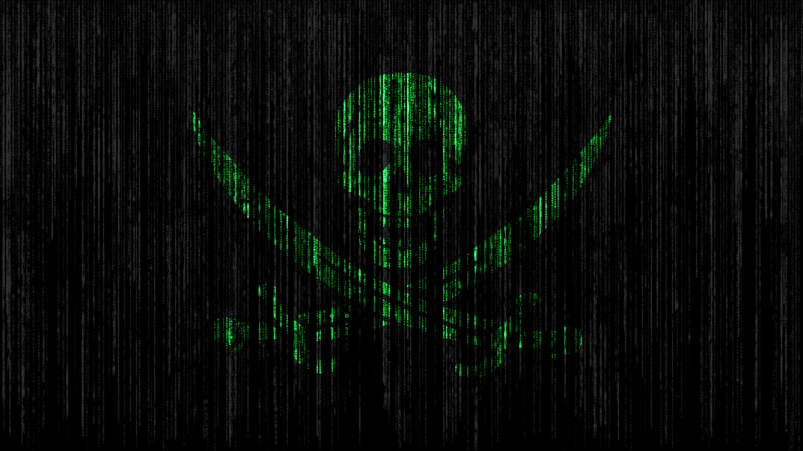 | 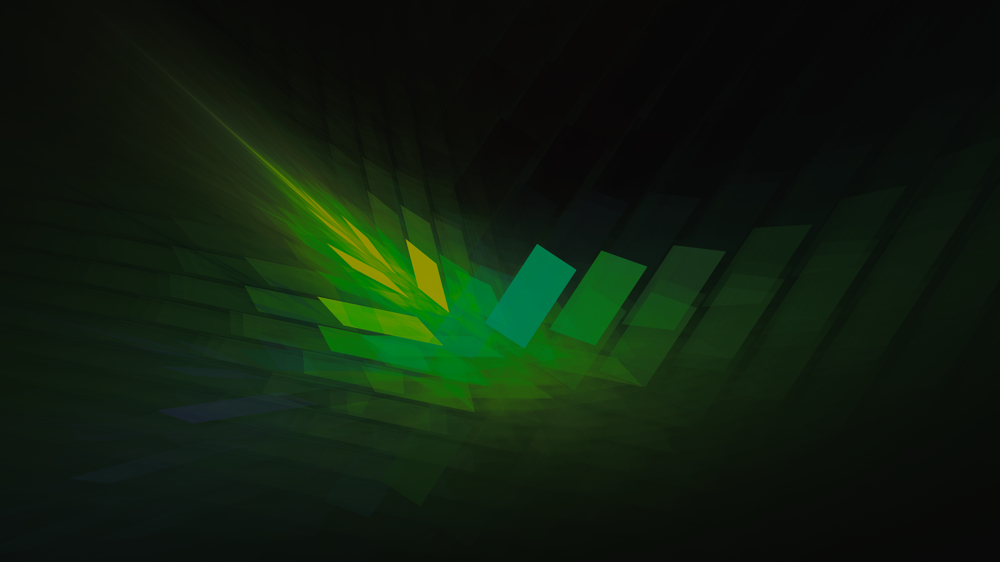 | 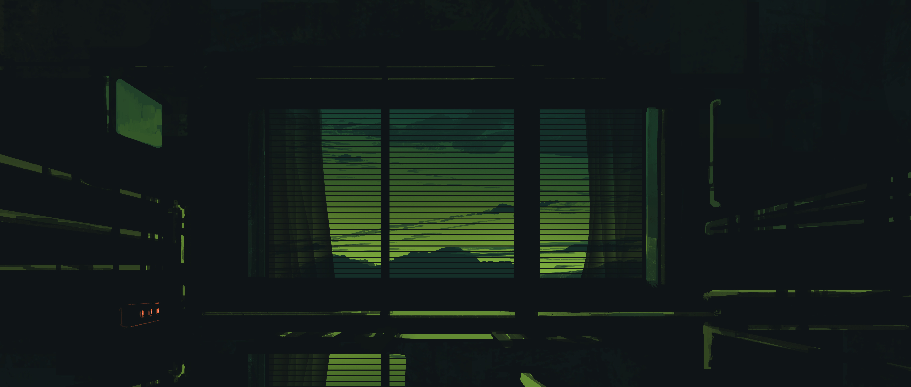 |
|  | 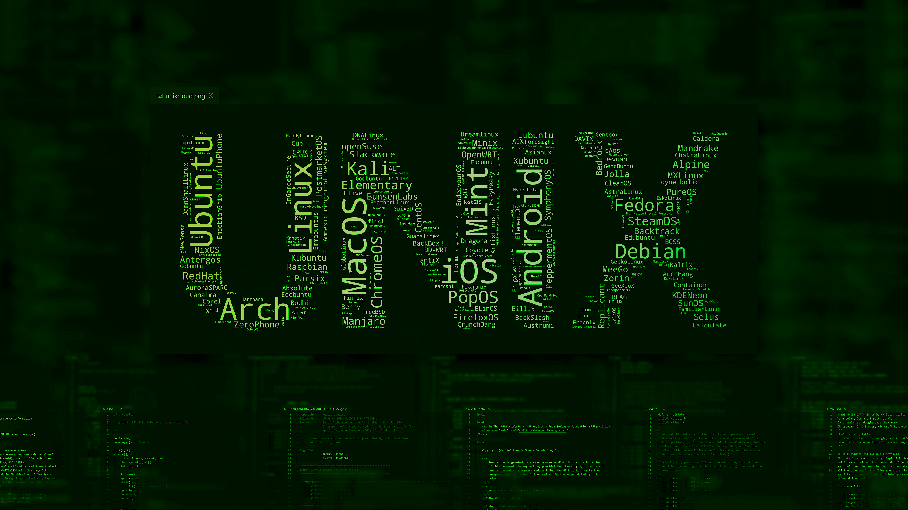 | 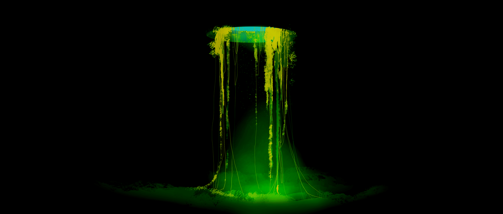 |
| 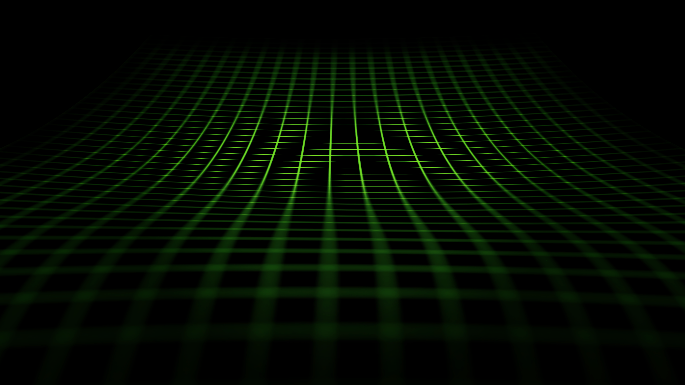 |  |  |

## Requirements

- A Hyprland-based desktop environment
- Waybar for the status bar
- Nerd Font Propo family (Hack, CaskaydiaMono, or JetBrains Nerd Font)
- DSEG7 or DSEG14 fonts for the segmented clock
- Yaru-sage icon theme

## Notes

- Palette derived from the Matrix Base16 colorscheme
- Wallpapers are from Wallhaven and sized to suit the bright-green phosphor palette
